# Marina
# Lämpömittari
### Kehitystiimi
  * Marika Forss
  * Nina Varpa
  
  
  
  ### Asiakaskertomus
  Kanban    | Sprintti   | Tuntikirjaukset
  --------- | ---------- | ----------------
  ||
  
  [Powered by Salpauksen hyvikset](https://www.salpaus.fi)
  
  
  ## Uusiprojekti
  ### Komponenttilista
  * kehityskortti 28,90€
  * led 1,70€
  * suurijännite vastus 0,80€
  ---
  [kytkentäkaavio] (https://phkk365-my.sharepoint.com/:i:/g/personal/marika_forss_edu_salpaus_fi/EXXqD0eFpK5Hko2ct6-_SrABdiCB8Kg2VE8x3xXXxwXcuQ?e=2ZYZIV)
  ---
  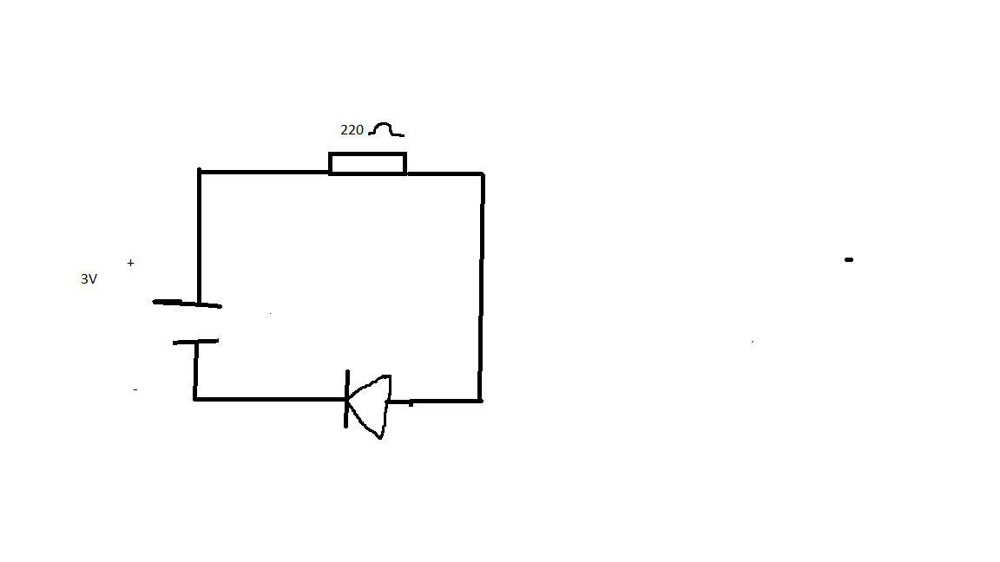
  # Liikennevalot 24.9.2021
```
// ------------
// Blink an LED
// ------------

/*-------------

We've heavily commented this code for you. If you're a pro, feel free to ignore it.

Comments start with two slashes or are blocked off by a slash and a star.
You can read them, but your device can't.
It's like a secret message just for you.

Every program based on Wiring (programming language used by Arduino, and Particle devices) has two essential parts:
setup - runs once at the beginning of your program
loop - runs continuously over and over

You'll see how we use these in a second. 

This program will blink an led on and off every second.
It blinks the D7 LED on your Particle device. If you have an LED wired to D0, it will blink that LED as well.

-------------*/


// First, we're going to make some variables.
// This is our "shorthand" that we'll use throughout the program:

// You'll need to wire an LED to this one to see it blink.

int ledred = D1; // Instead of writing D7 over and over again, we'll write led2
// This one is the little blue LED on your board. On the Photon it is next to D7, and on the Core it is next to the USB jack.
int ledyellow= D2;
int ledgreen= D3;
// Having declared these variables, let's move on to the setup function.
// The setup function is a standard part of any microcontroller program.
// It runs only once when the device boots up or is reset.

void setup() {

  // We are going to tell our device that D0 and D7 (which we named led1 and led2 respectively) are going to be output
  // (That means that we will be sending voltage to them, rather than monitoring voltage that comes from them)

  // It's important you do this here, inside the setup() function rather than outside it or in the loop function.

  pinMode(ledred, OUTPUT);
  pinMode(ledyellow, OUTPUT);
  pinMode(ledgreen, OUTPUT);
}

// Next we have the loop function, the other essential part of a microcontroller program.
// This routine gets repeated over and over, as quickly as possible and as many times as possible, after the setup function is called.
// Note: Code that blocks for too long (like more than 5 seconds), can make weird things happen (like dropping the network connection).  The built-in delay function shown below safely interleaves required background activity, so arbitrarily long delays can safely be done if you need them.

void loop() {
  // To blink the LED, first we'll turn it on...
  digitalWrite(ledred, HIGH);
  digitalWrite(ledyellow, LOW);
  digitalWrite(ledgreen, LOW);

  // We'll leave it on for 1 second...
  delay(1000);

  // Then we'll turn it off...
  digitalWrite(ledred, LOW);
  digitalWrite(ledyellow, HIGH);
  digitalWrite(ledgreen, LOW);

  // Wait 1 second...
  delay(1000);
  
  digitalWrite(ledred, LOW);
  digitalWrite(ledyellow, LOW);
  digitalWrite(ledgreen, HIGH);
  
  delay(1000);

  // And repeat!
}


```
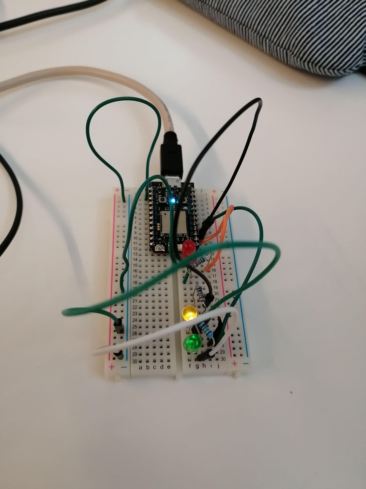
---

Maanantai 15.11.2021
Kaavio lämpömittarin teosta
---
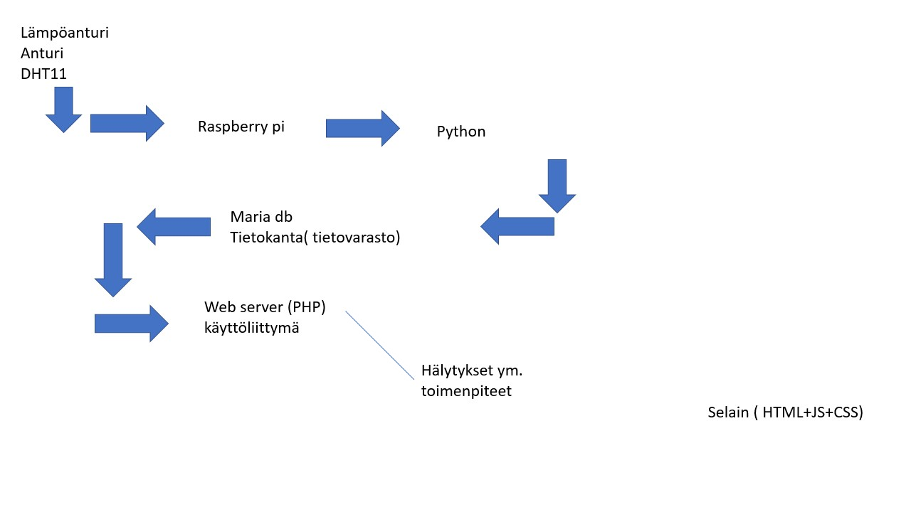
Kansiot/var/www/html
avaa text-editor
hhp:localhost
----
Opettajan koodi
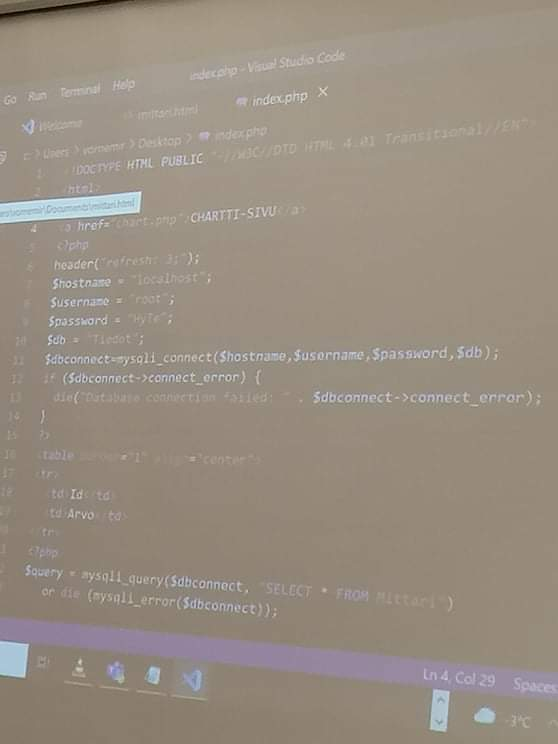
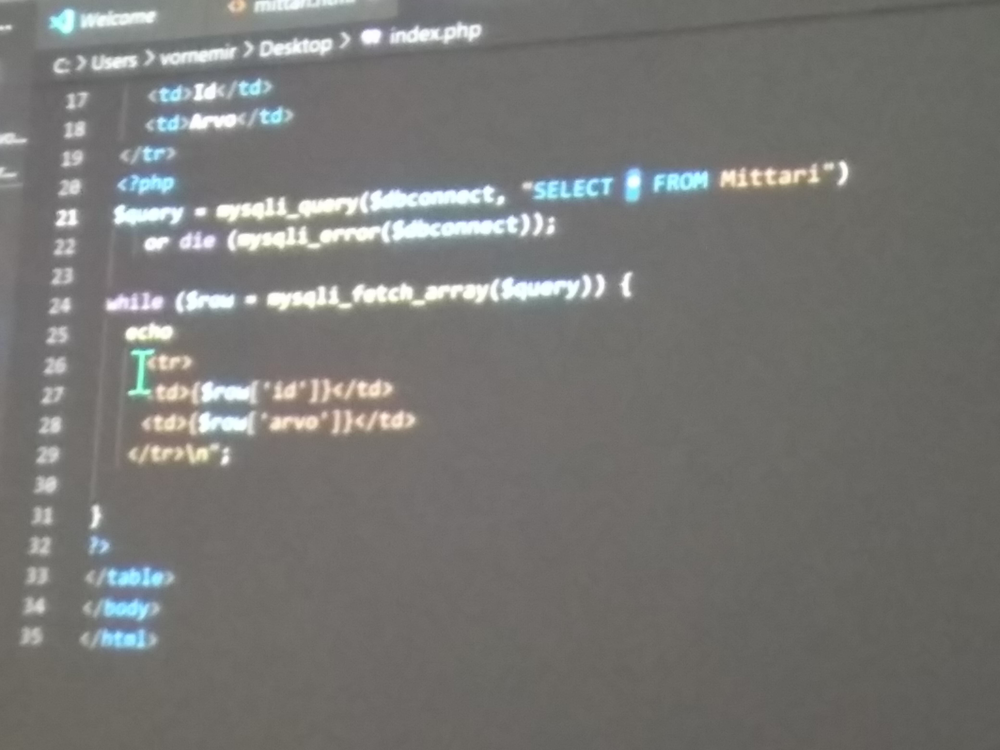
----
Koodia avuksi

---
Oma koodi valmiina
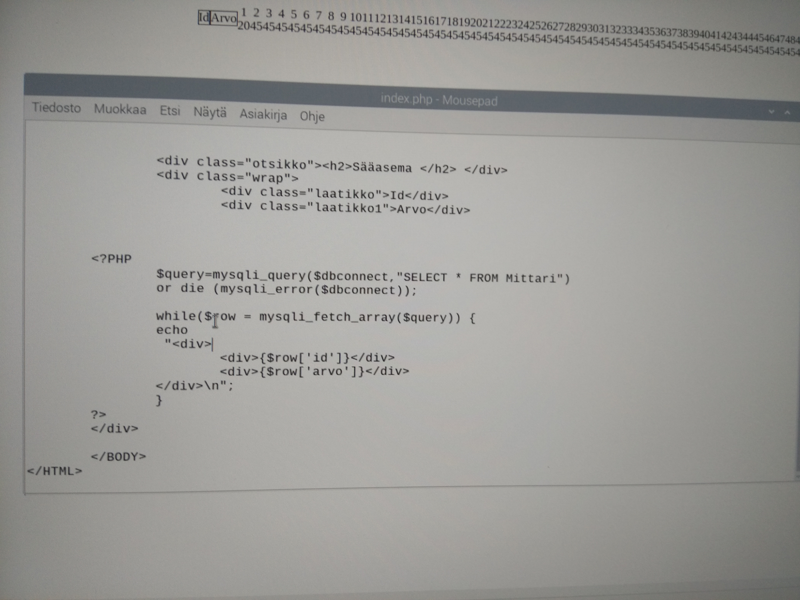
---
# Komentoikkuna
  *-mysgl -u root -p
  *Hyte
  *use Tiedot
 *SELECT * FROM Mittari;
---
 Maanantai 22.11.2021
 Koko koodi valmiina
 ---
  Koodia muutettiin niin että alakerran diveistä tehtiin samanlaiset kuin yläkerran divit ( vertaa kuvia) ja tehtiin linkki Chartti sivulle. 
  SQL hakua muutettiin näin SELECT*FROM Mittari ORDER BY id DESC LIMIT 20; Tällä koodilla haetaan 20 uusinta tulosta Mittari-kansiosta.
  ---


---
CHART koodi ja diagrammi
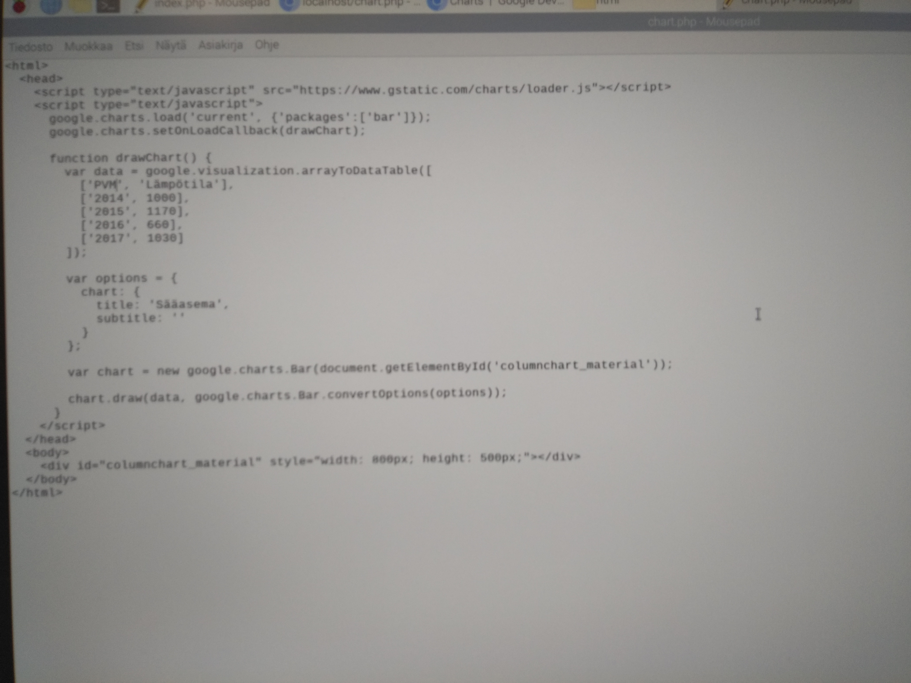

---
Maanantai 29.11.2021 
Chart.php lisättiin PHP:tä, jotta saatiin Mittarista haettua uusinta tietoa. Koodi oli samaa PHP:tä kuin HTML:ssä. Kuva koodista kun se on valmis.Chartti kun saatiin toimimaan, kytkettiin anturi kiinni. Anturin kytkentä tehtiin ohjeiden mukaan ( kuva kytkennästä). Sen jälkeen ruvettiin syöttämään esimerkki koodia.
---
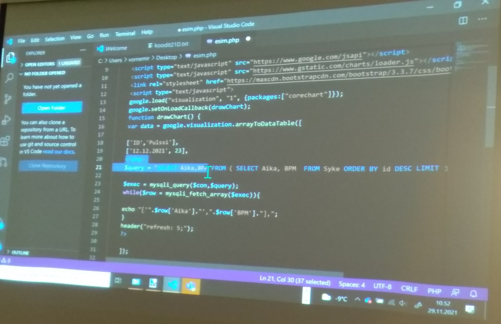
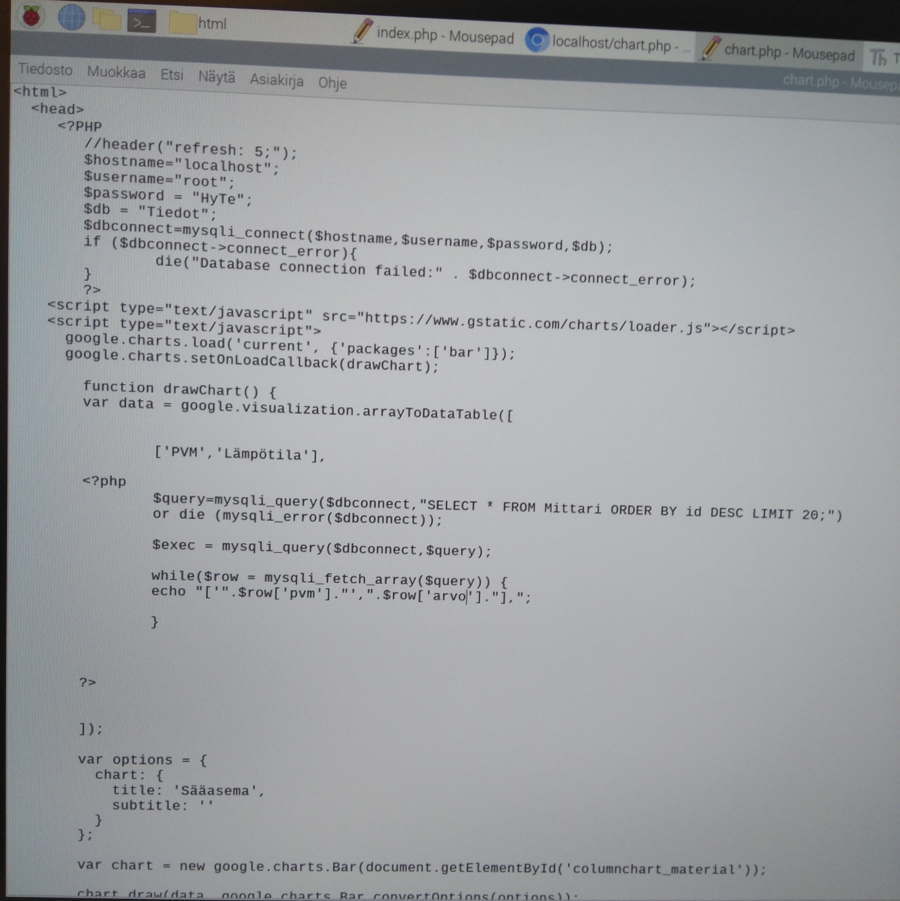
---
Anturin esimerkki kytkentä
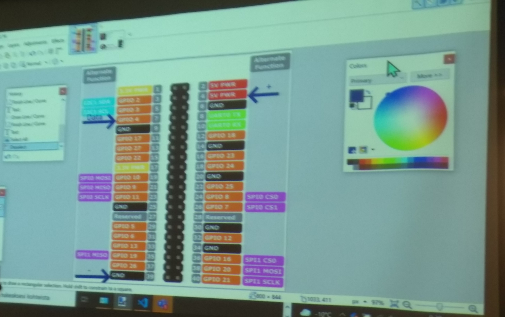
---
Maanantai 13.12.2021
---
Yritimme ratkaista kuinka saisimme anturilta tulemaan realiaikasta tietoa charttiin!
---
Koodivinkki anturille!!!
---

import time
import Adafruit_DHT
from datetime import datetime
import mariadb


DHT_SENSOR = Adafruit_DHT.DHT11
DHT_PIN = 4

#arvo= 2
conn = mariadb.connect(user="root", password="HyTe", host="localhost", database="Tiedot")
cur = conn.cursor()

while True:
    humidity, temperature = Adafruit_DHT.read(DHT_SENSOR, DHT_PIN)
    if humidity is not None and temperature is not None:
        print("Temp={0:0.1f}C Humidity={1:0.1f}%".format(temperature, humidity))
        cur.execute(f"INSERT INTO Mittari (arvo,pvm)VALUES('{temperature}', '{datetime.now()}')")
    else:
        print("else");
    time.sleep(3);

    #print(f'Python toimii: {datetime.now()}') 
    
 #   arvo += 2 
    conn.commit()
    
conn.close()

---
Anturi DHT11
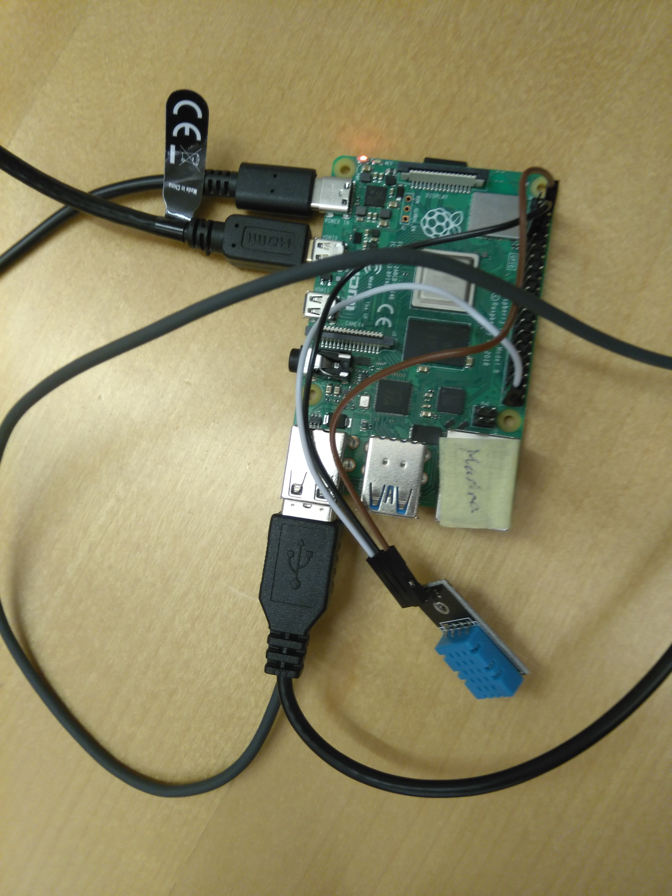
---
